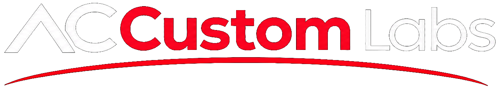

# AC Custom Labs

<p align="center">
  
</p>

<p align="center">
  <b>Independent Digital Product Studio & Engineering Agency</b><br />
  High-Performance Web Platforms · Autonomous AI Systems · Custom Java & Cloud Backends · Mobile Applications
</p>

<p align="center">
  <a href="https://cl8.vercel.app"></a>
  <a href="https://nextjs.org"></a>
  <a href="https://threejs.org"></a>
  <a href="https://www.typescriptlang.org"></a>
  <a href="https://tailwindcss.com"></a>
</p>

---

## 🏛 Overview

**AC Custom Labs** is an independent, engineer-led digital product studio. We eliminate layers of agency bloat and middle management, giving founders and enterprise clients direct access to senior practitioners. 

Our digital flagship combines an interactive **Kyoto Night Temple (Kage)** WebGL experience with a full-stack Next.js web application, featuring live portfolio deployments, comprehensive technical capabilities, and direct project initiation protocols.

---

## 🚀 Live Portfolio Deployments

All projects featured on our platform are live, verified client and internal product deployments:

| Project | Domain | Architecture & Highlights | Live Demo |
| :--- | :--- | :--- | :--- |
| **CL8 — Terminal AI Assistant** | AI & Developer Tooling | Autonomous command-line companion built by Amit Chauhan. Multi-provider LLMs (Local Ollama, Google Gemini, OpenAI), zero context switching, codebase intelligence, git automation, desktop task execution. | [cl8.vercel.app ↗](https://cl8.vercel.app) |
| **Vikings Gym & Spa** | Luxury Fitness & Wellness | Sub-100ms edge transitions, dynamic membership tier selectors, trainer rosters, integrated WhatsApp booking, 100/100 Core Web Vitals. | [vikingsgym.in ↗](https://vikingsgym.in) |
| **Mars Remedies** | Enterprise Pharma & Health | WHO-GMP & ISO 9001:2015 certified pharmaceutical company showcase. 110+ formulations, regulatory documentation, international B2B buyer pipeline. | [marsremedies.co.in ↗](https://marsremedies.co.in) |
| **BBC Pro Gym** | Athletic Conditioning Club | High-octane contrast aesthetics, workout program breakdowns, membership conversion channels, local SEO & Google Search Console indexing. | [bbcpro.vercel.app ↗](https://bbcpro.vercel.app) |
| **Real Looks Unisex Salon** | Grooming & Salon Booking | Contemporary unisex styling menu, bridal portfolios, verified testimonials, mobile-first WhatsApp booking flow with prefilled service inquiries. | [reallooks.vercel.app ↗](https://reallooks.vercel.app) |
| **BB Real Estate** | Luxury & Commercial Property | High-resolution architectural layout viewers, residential and commercial parcel filtering, panoramic tours, direct broker telemetry. | [bbrealestate.vercel.app ↗](https://bbrealestate.vercel.app) |

> 📁 **Full Portfolio Archive**: Visit [`/work`](/work) to view all production deployments with technical specifications, architecture diagrams, and stack breakdowns.

---

## ⚡ Studio Capabilities & Technology Matrix

We provide end-to-end digital engineering across six core architectural pillars:

### 1. Java Systems & Custom Software
- **Core Technologies**: Java, Spring Boot, Microservices, Python, Node.js, PostgreSQL, Redis.
- **Scope**: Enterprise backends, custom CRM architectures, zero-trust API gateways, distributed systems, and scalable operational tooling.

### 2. Next.js Platforms & Modern E-Commerce
- **Core Technologies**: Next.js 16 (App Router), React 19, TypeScript, Tailwind CSS, WebGL (Three.js), Headless Shopify/WooCommerce, WordPress Hosting.
- **Scope**: Sub-second edge web applications, high-converting E-Commerce platforms, responsive UI engineering, and bespoke CMS workflows.

### 3. Mobile App Engineering
- **Core Technologies**: React Native, Expo, Swift, Kotlin, Biometric Auth, Offline SQLite.
- **Scope**: Production iOS and Android mobile applications engineered for fluid 120Hz gesture physics, biometric security, and offline data synchronization.

### 4. Next-Gen Search, SEO, SXO, AEO & GEO
- **Core Technologies**: Technical SEO, SXO (Search Experience Optimization), AEO (Answer Engine Optimization for ChatGPT & Perplexity), GEO (Generative Engine Optimization), Google Search Console, Rapid Indexing APIs, Local Search Analysis.
- **Scope**: Dominating traditional search engines and AI generative discovery networks, schema graph markup, and localized business presence.

### 5. UI/UX Design & Brand Identity
- **Core Technologies**: Figma, Adobe Creative Cloud, Design Tokens, Vector Systems, Typography Scales.
- **Scope**: High-contrast design systems, sharp architectural UI components, bespoke logo creation, comprehensive branding guidelines, and marketing collateral.

### 6. Cloud Infrastructure & Dedicated Servers
- **Core Technologies**: Dedicated Linux Servers, Cloudflare Edge DNS, Vercel, AWS/GCP, Docker, SSL/TLS, DMARC/SPF/DKIM.
- **Scope**: Managed cloud deployments, dedicated server provisioning, DDoS hardening, 99.99% uptime monitoring, ongoing site maintenance, and 24/7 technical support.

---

## 🎨 Design Philosophy & Architecture

```
Obsidian Night (#05070a)  ─── Environment & Depth
Celestial Cyan (#38bdf8)  ─── High-Value Signal & Telemetry
Pale Sage Bone (#dfe7e0)  ─── Crisp Readable Information
Sharp 90° Geometry        ─── Edgy, Zero-Curve Architecture
```

- **Interactive Canvas**: Custom Three.js WebGL rendering pipeline with smooth inertial scrolling (`Lenis`), GLSL fabric shaders, and dynamic lighting effects.
- **Zero-Bloat Engineering**: Native platform APIs, minimal overhead dependencies, clean Git version control, and 100% client code ownership.

---

## 🛠 Local Development & Setup

### Prerequisites
- **Node.js**: v18.18+ or v20+ (tested on Node v24)
- **Package Manager**: npm 10+

### Installation

```bash
# 1. Clone repository
git clone https://github.com/ritwikamit/ACCustomLabs.git
cd ACCustomLabs

# 2. Install dependencies
npm install

# 3. Environment configuration
cp .env.example .env.local

# 4. Start local development server
npm run dev
```

Open [http://localhost:3000](http://localhost:3000) in your browser.

### Quality Assurance & Build Commands

```bash
# Typecheck TypeScript definitions
npm run typecheck

# Lint codebase
npm run lint

# Compile production bundle
npm run build
```

---

## 📂 Project Structure

```text
AC_CustomLabs/
├── app/
│   ├── layout.tsx         # Root layout with Organization & ProfessionalService JSON-LD schemas
│   ├── page.tsx           # Interactive 3D Kage Temple flagship landing experience
│   ├── work/page.tsx      # Comprehensive portfolio archive (CL8, Vikings, Mars Remedies, etc.)
│   ├── services/page.tsx  # Detailed capabilities & architecture services breakdown
│   ├── about/page.tsx     # Studio manifesto and engineering philosophy
│   ├── contact/page.tsx   # Direct inquiry protocol & booking channels
│   ├── sitemap.ts         # Dynamic sitemap indexer
│   └── robots.ts          # Search engine crawler instructions
├── components/            # Reusable UI components (Navbar, Footer, etc.)
├── public/
│   ├── brand/             # Official AC Custom Labs high-res logos
│   ├── capabilities/      # Bespoke 3D graphics for capabilities (Java, Web, Mobile, Search, etc.)
│   ├── projects/          # High-resolution client & product showcase assets (CL8, Vikings, etc.)
│   └── landing-pages/     # Standalone authored WebGL experiences (kage.html)
└── data/                  # Static type-safe datasets for site content and services
```

---

## 🔒 Security & Performance Features

- **Strict Content Security Policy (CSP)**: Hardened headers configured in `next.config.ts`.
- **Honeypot Anti-Spam Protection**: Invisible security traps on enquiry endpoints to deter automated scrapers.
- **Zero Credential Commits**: Strict `.gitignore` policy and `.env.example` guidance.
- **Edge Deployment**: Global multi-region edge caching with sub-100ms time to first byte.

---

## 🤝 Project Inquiries & Contact

Have an ambitious digital product to build or legacy architecture to modernize?

- **WhatsApp**: [+91 9113445763](https://wa.me/919113445763?text=Hi%20AC%20Custom%20Labs%2C%20I%20would%20like%20to%20enquire%20about%20a%20project.)
- **Phone**: [+91 9113445763](tel:+919113445763)
- **Email**: [contact@accustomlabs.com](mailto:contact@accustomlabs.com)
- **GitHub**: [github.com/ritwikamit](https://github.com/ritwikamit)

---

## 📜 Credits & License

**Designed and Developed by Team · AC Custom Labs**  
© 2026 AC Custom Labs. All rights reserved.